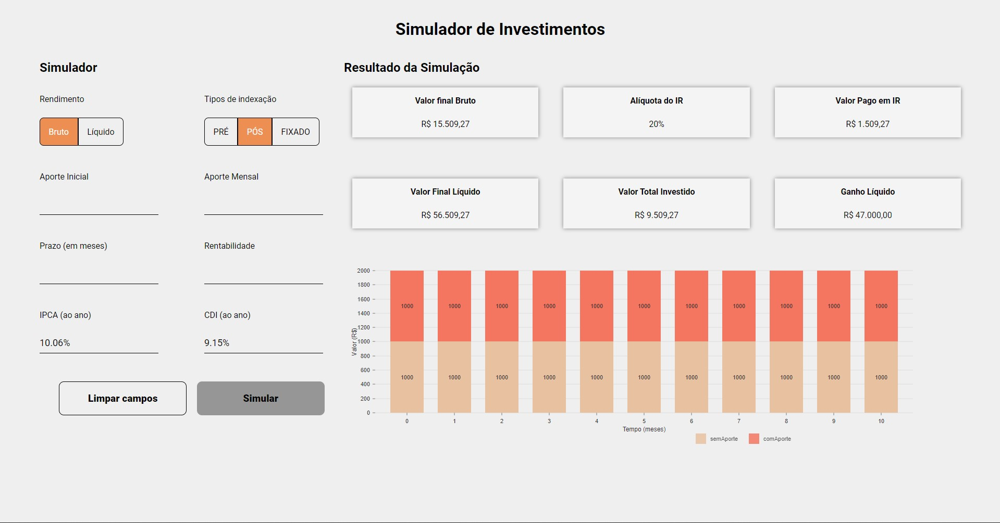

# Desafio Eqi Investimentos - Desenvolvedor Front-end Jr
O objetivo do projeto é a construção de um front-end para um Simulador de Investimentos, seguindo as instruções contidas no [repositório principal](https://github.com/eqi-investimentos/desafio-frontend).

> "A aplicação deverá permitir ao usuário realizar uma simulação de rendimentos de acordo com o tipo de indexação e tipo de rendimento escolhido."

### ✅ To Do List

Por ainda estar em desenvolvimento, há algumas tarefas a serem feitas:

- [ ] Funcionalidade botão limpar campos
- [ ] Funcionalidade botão simular
- [ ] Ajustes nos botões de rendimento e indexação
- [ ] Ajustes no gráfico
- [ ] Colocar dados do resultado dinamicamente

## 🚀 Tecnologias utilizadas
- ReactJS
- Sass
- TypeScript
- Axios
- ViteJS
- Nivo Rocks

## 💻 Como rodar

1. Clonar a [API Fake](https://github.com/eqi-investimentos/desafio-fake-api) com `git clone`;
2. Entrar na pasta e instalar as dependências da API usando `yarn`;
3. Rodar  com `yarn json-server db.json` (abrirá em localhost 3000);
2. Clonar [este projeto](https://github.com/lineavelino/desafio-eqi-investimentos) usando `git clone`;
3. Entrar na pasta e instalar as dependências com `yarn`;
4. Rodar o projeto usando `yarn dev`
5. Abra localhost 3001 para vê-lo em seu browser.